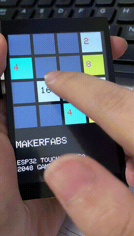
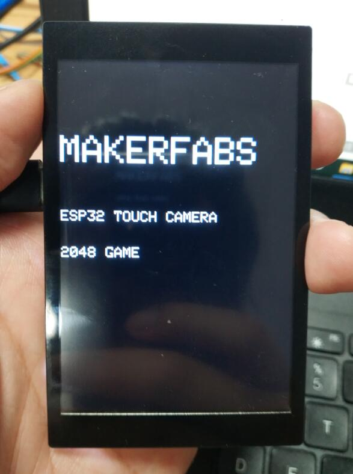

# ESP32 2048 GAME

```c++
/*
Version:		V1.0
Author:			Vincent
Create Date:	2020/9/9
Note:
	
*/
```





[toc]

# OVERVIEW

## Introduce

[Makerfabs home page](https://www.makerfabs.com/)

[Makerfabs Wiki](https://makerfabs.com/wiki/index.php?title=Main_Page)

Implement a 2048 game on "ESP32 Touch Camera". Change from [ATmega328-Flappy-Bird-Clone](https://github.com/mrt-prodz/ATmega328-Flappy-Bird-Clone).

This time, a capacitive screen was used for the game experience much better.

## Equipment list

- ESP32 Touch Camera


# ESP32 Touch Camera

## ~~Product link ：~~[ ~~ESP32 Touch Camera~~]() 

[ESP32 Touch Camera](https://www.youtube.com/watch?v=zWUy4gcwMs4&feature=youtu.be)

The ESP32 Touch Camera use ILI9488 screen, which comes with resistive or capacitive screens. Hava an OV2640 camera and SD card slot. It can be used as a webcam, an electronic album, or a digital camera. Support for Arduino and MicroPython. 

## Feature

- Integrated ESP32 2.4G WiFi and Bluetooth.
- Micro SD card slot on board.
- Input 5.0V Type-C USB .
- OV2640 is a 1/4 inch CMOS UXGA (1632*1232) image sensor manufactured by OmniVision.
- LCD 3.5 inch Amorphous-TFT-LCD (Thin Film Transistor Liquid Crystal Display) for mobile-phone or handy electrical equipments.
- NS2009 is A 4-wire resistive touch screen control circuit with I2C interface, which contains A 12-bit resolution A/D converter.

- The FT6X36 Series ICs are single-chip capacitive touch panel controller IC with a built-in 16 bit enhanced Micro-controller unit (MCU).

# STEPS

## Prepare And Burn

**If you have any questions，such as how to install the development board, how to download the code, how to install the library. Please refer to :[Makerfabs_FAQ](https://github.com/Makerfabs/Makerfabs_FAQ)**

- Install board : esp32 .
- Install library : lovyanGFX library. 
- Upload file "/Project_ESP32-Flappy-Bird/ILI9488_bird/ILI9488_bird.ino"
- Touch To Play！




## How To Play

